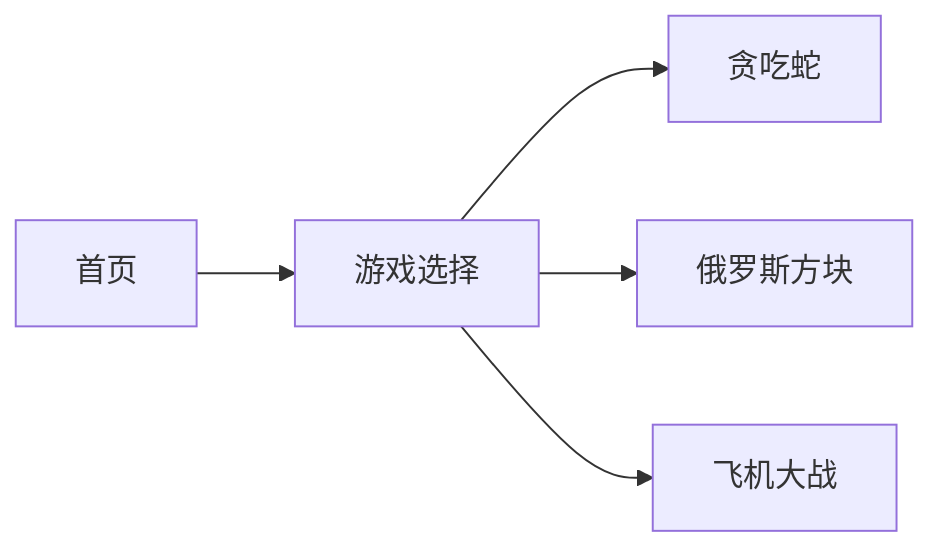

## 1. Architecture Design


## 2. Technology Description
- Frontend: React@18 + tailwindcss@3 + vite
- Initialization Tool: vite-init
- Backend: None (纯前端游戏)
- Database: None (本地存储最高分)

## 3. Component Structure
```
src/
├── App.tsx                     # 路由主组件
├── components/
│   ├── HomePage.tsx            # 首页
│   ├── SnakeGame.tsx           # 贪吃蛇游戏
│   ├── TetrisGame.tsx          # 俄罗斯方块游戏
│   ├── PlaneGame.tsx           # 飞机大战游戏
│   ├── GameCanvas.tsx          # 通用Canvas组件
│   └── ScorePanel.tsx          # 通用计分组件
├── hooks/
│   ├── useSnakeGame.ts         # 贪吃蛇游戏逻辑
│   ├── useTetrisGame.ts        # 俄罗斯方块游戏逻辑
│   └── usePlaneGame.ts         # 飞机大战游戏逻辑
├── utils/
│   ├── gameUtils.ts            # 贪吃蛇工具
│   ├── tetrisUtils.ts          # 俄罗斯方块工具
│   └── planeUtils.ts           # 飞机大战工具
└── types/
    └── game.ts                 # 类型定义
```

## 4. State Management
- 使用React useState管理本地游戏状态
- 使用localStorage保存各游戏的最高分

## 5. Game Logic Summary

### 贪吃蛇
- 方向键控制蛇移动
- 吃食物得分并增长
- 撞墙或自身游戏结束

### 俄罗斯方块
- 方向键控制方块移动和旋转
- 方块自动下落
- 一行填满消除得分
- 方块堆到顶部游戏结束

### 飞机大战
- 左右方向键或A/D控制飞机移动
- 空格键发射子弹
- 击落敌机得分
- 敌机碰撞或到达底部游戏结束